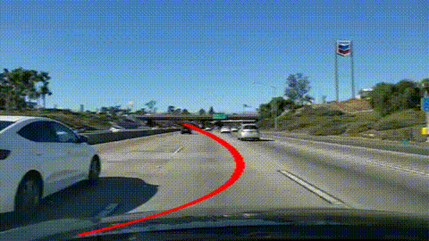

# Autonomous Lane Detection

Semantic segmentation-based lane detection using U-Net with a MobileNetV2 encoder, trained on the TuSimple dataset, with polynomial curve fitting for lane geometry and vehicle offset estimation.

## Demo



## Architecture

U-Net decoder with a MobileNetV2 encoder pretrained on ImageNet, fine-tuned on TuSimple for binary lane segmentation.

## Results

| Stage | Val IoU |
|---|---|
| Baseline (no augmentation) | 0.67 |
| With data augmentation | 0.76 |

## Pipeline

1. Image -> trained U-Net -> binary segmentation mask
2. Mask -> connected components -> separate lane blobs
3. Polynomial curve fitting per lane
4. Vehicle lane-offset estimation

## Setup

```bash
conda create -n lanedetect python=3.10 -y
conda activate lanedetect
pip install -r requirements.txt
```

## Usage

```bash
python src/inference/predict.py       # run on sample images
python src/inference/video_infer.py   # run on video
```

## Project Structure
lane-detection/
├── src/
│   ├── data/
│   ├── models/
│   ├── training/
│   ├── inference/
│   └── utils/
├── models/          # trained checkpoints (gitignored)
├── outputs/         # demo results
└── requirements.txt

## Notes

The video demo above uses out-of-domain footage (not TuSimple) to demonstrate generalization — the reported IoU (0.76) is measured on the TuSimple validation set specifically, not on this demo clip.
